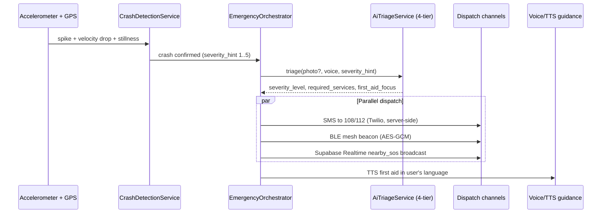
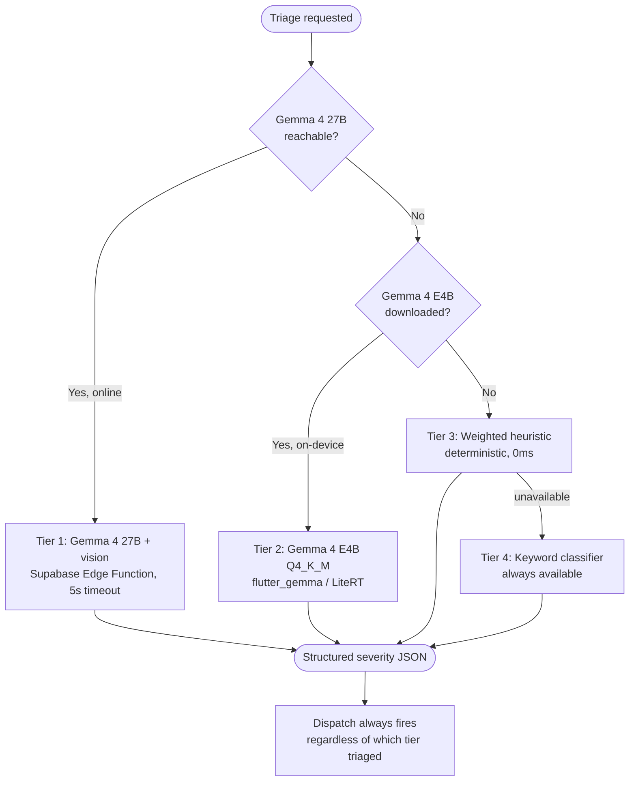
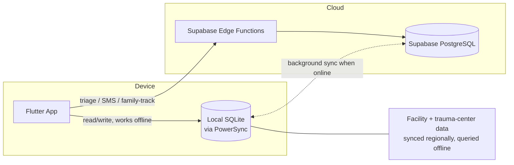
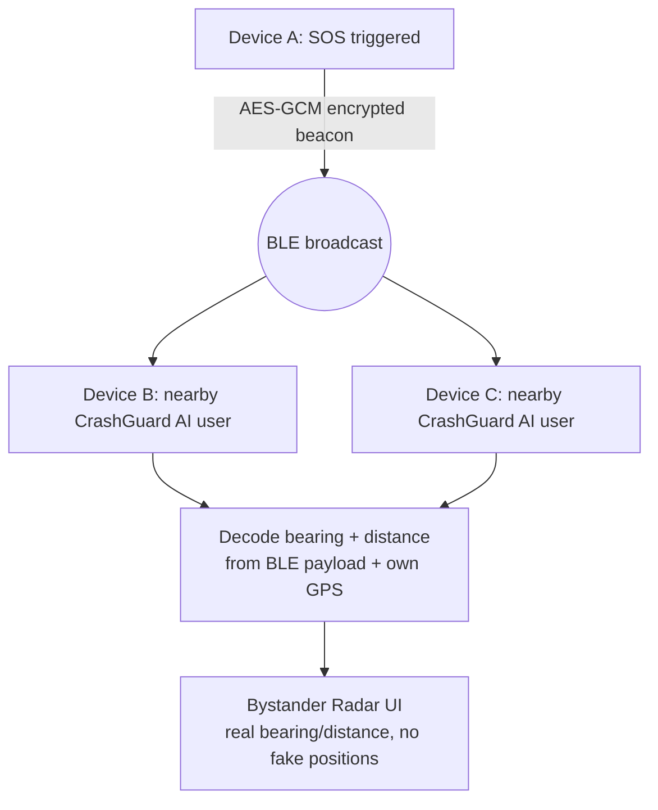

# Architecture Diagrams

Hand-authored diagrams for the flows that matter most in CrashGuard AI. For the
auto-generated dependency graph, see
[`docs/architecture/architecture.md`](architecture/architecture.md).

## Emergency workflow (crash to dispatch)

## AI inference tiers (degradation path)

## Offline-first data sync

## BLE mesh communication

