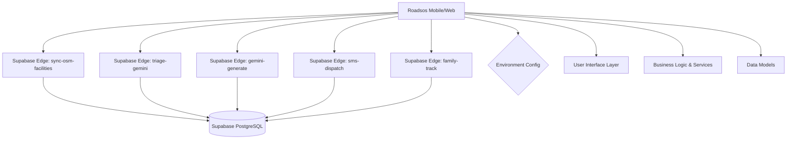
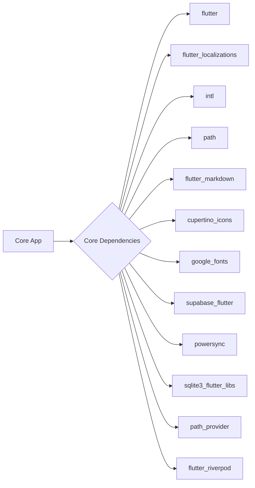

# System Architecture

## Dynamic High-Level Architecture

```mermaid
graph TD
    Client[Roadsos Mobile/Web] 
    Client --> Function_sync_osm_facilities[Supabase Edge: sync-osm-facilities]
    Function_sync_osm_facilities --> SupabaseDB[(Supabase PostgreSQL)]
    Client --> Function_triage_gemini[Supabase Edge: triage-gemini]
    Function_triage_gemini --> SupabaseDB[(Supabase PostgreSQL)]
    Client --> Function_gemini_generate[Supabase Edge: gemini-generate]
    Function_gemini_generate --> SupabaseDB[(Supabase PostgreSQL)]
    Client --> Function_sms_dispatch[Supabase Edge: sms-dispatch]
    Function_sms_dispatch --> SupabaseDB[(Supabase PostgreSQL)]
    Client --> Function_family_track[Supabase Edge: family-track]
    Function_family_track --> SupabaseDB[(Supabase PostgreSQL)]
    Client --> EnvVars{Environment Config}
    Client --> UI[User Interface Layer]
    Client --> Services[Business Logic & Services]
    Client --> Models[Data Models]
```

## Core Dependencies

```mermaid
graph LR
    App[Core App] --> CoreDeps{Core Dependencies}
    CoreDeps --> flutter
    CoreDeps --> flutter_localizations
    CoreDeps --> intl
    CoreDeps --> path
    CoreDeps --> flutter_markdown
    CoreDeps --> cupertino_icons
    CoreDeps --> google_fonts
    CoreDeps --> supabase_flutter
    CoreDeps --> powersync
    CoreDeps --> sqlite3_flutter_libs
    CoreDeps --> path_provider
    CoreDeps --> flutter_riverpod
```
